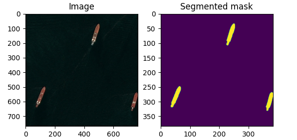
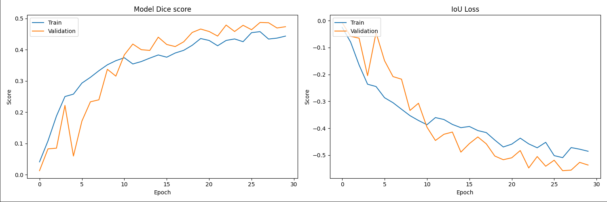
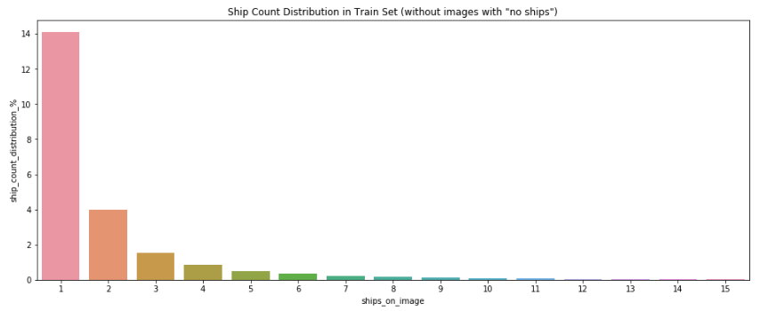

# Airbus Ship Detection Challenge

Semantic segmentation of ships in satellite images [Kaggle competition](https://www.kaggle.com/competitions/airbus-ship-detection/overview).
The dataset for this task can be found [here](https://www.kaggle.com/competitions/airbus-ship-detection/data).

## Project Structure

- EDA.ipynb: Jupyter notebook analyzing the dataset
- preparation_balanced_df.py: Python file for preparation training datasets
- balanced_dfs: Folder with balanced dataframes after executing preparation_balanced_df.py
- model_training.py: Python file for model training
- pretrained_models: Folder with pretrained models after executing model_training.py
- plot_training_metrics: Folder with charts with accuracy and loss metrics after executing model_training.py
- model_inference.py: Python file for model inference
- test_images: Folder with 50 satellite images for testing on model_inference.py
- segmented_images: Folder with segmented images after executing model_inference.py
- requirements.txt: List of required Python modules

## How to Run

1) preparation_balanced_df.py based on balanced_dfs/train_ship_segmentations_v2.csv
prepares two additional dataframes balanced by the number of masks in each image:
    - balanced_dfs/balanced_train_df_1.csv - 100% images with masks;
    - balanced_dfs/balanced_train_df_2.csv - 50% of images with masks and 50% without masks.
2) model_training.py trains the model in two iterations (on two balanced data sets)
and save (depending on the size of the images supplied to the model input: 768 or 384) the trained models (at each training iteration):
   - pretrained_models/trained_local/384_best_weight_model_1.h5 - after the first iteration of training;
   - pretrained_models/trained_local/384_best_weight_model_2.h5 - after the second iteration of training.
   It also saves graphs of the evolution of the Dice and Loss metrics at the training epochs:
   - plot_training_metrics/plot-1.png - after the first iteration of training;
   - plot_training_metrics/plot-2.png - after the second iteration of training.
3) model_inference.py uses two functions to test the model on new images: 
   - def segmentation_random_images displays and saves 5 random images to a folder: segmented_images/segmented_5_images.png
   - def segmentation_load_image displays and saves 1 selected image to a folder: (segmented_images/segmented_loaded_image.png), - but for it to work, you need to set the path (**image_path**) to this image in the file.

## Evaluation Metrics

The evaluation metric for this competition is [Dice coefficient](https://en.wikipedia.org/wiki/S%C3%B8rensen%E2%80%93Dice_coefficient).
This is a measure of the similarity between two sets, A and B. The coefficient ranges from 0 to 1, where 1 indicates that the two sets are identical, and 0 indicates that the two sets have no overlap. It is defined as:

Dice coefficient = 2 * |A ∩ B| / (|A| + |B|)

Where |A| represents the number of elements in set A, and |B| represents the number of elements in set B. |A ∩ B| represents the number of elements that are present in both sets.

## Architecture

1) U-net model with additional BatchNormalization in each layer
2) Optimizer - RMSprop(start_lr=1e-3) with reduceLROnPlat(factor=0.5, patience=3)
3) Loss function - modified IoU metric:
   loss_score = - |A ∩ B| / (|A ∪ B| - 0,1 * |A|)

## EDA:

All images in the Train and Test sets have the same size: (768, 768).
The training dataset contains 150.000 images (77.9%) without masks, which looks like an overestimated number for the non-target class.
The number of masks in one photograph among the remaining images (in the training data set) has the following distribution: 
   * 42,556 images (23%) contain from 1 ship (14.08%) to 15 ships (0.03%).

   
## Environment:

For training on a video card, I used [tensorflow-gpu==2.10.0](https://www.tensorflow.org/install/source_windows). To install this library, you must use the following auxiliary tools:
   * [Bazel 5.1.1](https://github.com/bazelbuild/bazel/releases?q=5.1.1&expanded=true)
   * [cuDNN](https://developer.nvidia.com/rdp/cudnn-archive)
   * [CUDA](https://developer.nvidia.com/cuda-toolkit-archive)
   

