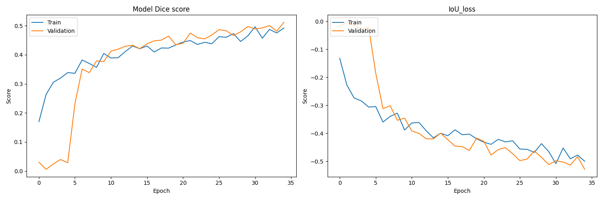

# Airbus Ship Detection Challenge

Semantic segmentation of ships in satellite images [Kaggle competition](https://www.kaggle.com/competitions/airbus-ship-detection/overview).
The dataset for this task can be found [here](https://www.kaggle.com/competitions/airbus-ship-detection/data).

## Project Structure

- **EDA.ipynb** Jupyter notebook analyzing the dataset.
- **preparation_balanced_df.py**: Python file for preparation training datasets.
- **model_training.py**: Python file for model training.
- **model_inference.py**: Python file for model inference.
- **balanced_dfs**: Folder with balanced dataframes *(after executing preparation_balanced_df.py)*.
- **pretrained_models**: Folder with pretrained models *(after executing model_training.py)*.
- **plot_training_metrics**: Folder with charts of accuracy and loss metrics *(after executing model_training.py)*.
- **test_images**: Folder with 50 satellite images *(for testing on model_inference.py)*.
- **segmented_images**: Folder with segmented images *(after executing model_inference.py)*.
- **requirements.txt**: List of required Python modules

## How to Run
* unzip balanced_dfs/train_ship_segmentations_v2.zip
1) **preparation_balanced_df.py** based on *balanced_dfs/train_ship_segmentations_v2.csv*
prepares two additional dataframes balanced by the number of masks in each image:
    - *balanced_dfs/balanced_train_df_1.csv* - 100% images with masks;
    - *balanced_dfs/balanced_train_df_2.csv* - 50% of images with masks and 50% without masks.
2) **model_training.py** trains the model in two iterations (on two balanced data sets)
and save (depending on the size of the images supplied to the model input: 768 or 384) the trained models (at each training iteration):
   - *pretrained_models/trained_local/384_best_weight_model_1.h5* - after the first iteration of training;
   - *pretrained_models/trained_local/384_best_weight_model_2.h5* - after the second iteration of training.
   It also saves graphs of the evolution of the Dice and Loss metrics at the training epochs:
   - *plot_training_metrics/plot-1.png* - after the first iteration of training;
   - *plot_training_metrics/plot-2.png* - after the second iteration of training.
3) **model_inference.py** uses two functions to test the model on new images: 
   - *def segmentation_random_images* displays and saves 5 random images to a folder: *segmented_images/segmented_5_images.png*.
   - *def segmentation_load_image* displays and saves 1 selected image to a folder: *segmented_images/segmented_loaded_image.png*, - but for it to work, you need to set the path (**image_path**) to this image in the file.

## Evaluation Metrics

The evaluation metric for this competition is [Dice coefficient](https://en.wikipedia.org/wiki/S%C3%B8rensen%E2%80%93Dice_coefficient).
This is a measure of the similarity between two sets, A and B. The coefficient ranges from 0 to 1, where 1 indicates that the two sets are identical, and 0 indicates that the two sets have no overlap. It is defined as:

Dice coefficient = 2 * |A ∩ B| / (|A| + |B|)

Where |A| represents the number of elements in set A, and |B| represents the number of elements in set B. |A ∩ B| represents the number of elements that are present in both sets.

## Architecture

1) U-net model with additional BatchNormalization in each layer.
2) Optimizer - RMSprop(start_lr=1e-3) with reduceLROnPlat(factor=0.5, patience=3).
3) Loss function based on IoU metric.

## EDA:

All images in the Train and Test sets have the same size: (768, 768).
The training dataset contains 150.000 images (77.9%) without masks, which looks like an overestimated number for the non-target class.
The number of masks in one photograph among the remaining images (in the training data set) has the following distribution: 
   * 42,556 images (23%) contain from 1 ship (14.08%) to 15 ships (0.03%).

   
## Environment:

For training on a video card, I used [tensorflow-gpu==2.10.0](https://www.tensorflow.org/install/source_windows). To install this library, you must use the following auxiliary tools:
   * [Bazel 5.1.1](https://github.com/bazelbuild/bazel/releases?q=5.1.1&expanded=true)
   * [cuDNN](https://developer.nvidia.com/rdp/cudnn-archive)
   * [CUDA](https://developer.nvidia.com/cuda-toolkit-archive)
   

